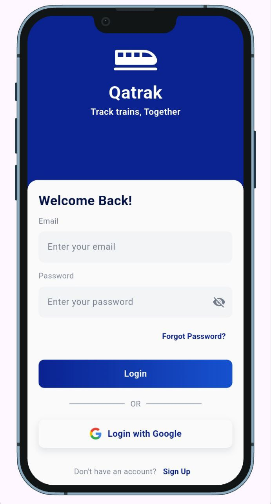
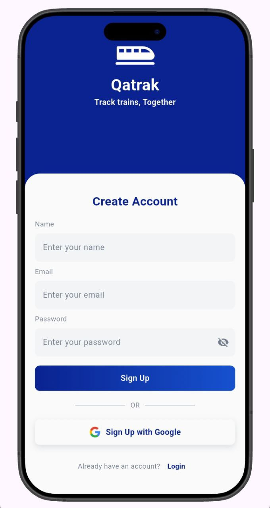
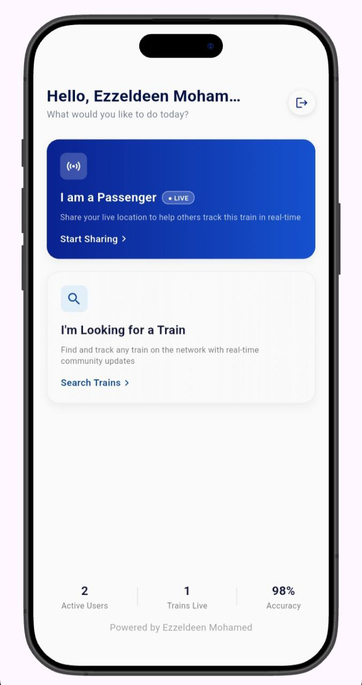
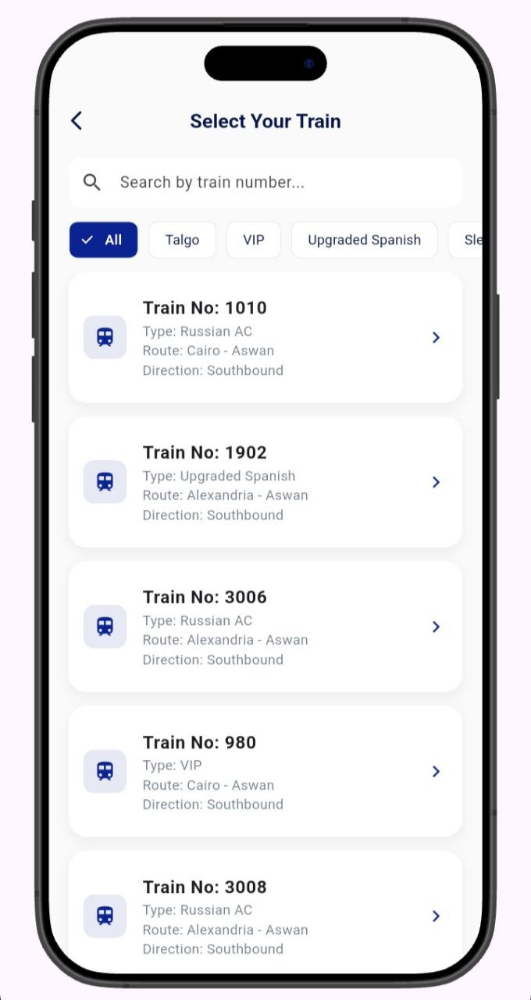

## Qatrak (قطرك) - Real-time Train Tracking System

  

---

## 🌟 Overview
**Qatrak** is a community-driven real-time train tracking application designed to solve the uncertainty of train timings. By leveraging crowdsourced live location sharing, passengers can help each other track trains across the network with high accuracy.

## ✨ Key Features
* **📍 Live Tracking:** Real-time location updates using Supabase Realtime.
* **🔐 Secure Auth:** Robust authentication flow with **OTP (One-Time Password)** for password resets.
* **📡 Offline Resilience:** Global network monitoring with a custom "Retry Connection" UI.
* **🔋 Battery Optimized:** Intelligent location broadcasting to save passenger's battery.
* **🏃‍♂️ Background Service:** Keeps tracking alive even when the app is minimized.
* **💰 AdMob Integration:** Optimized ad placement for a sustainable ecosystem.

## 📸 Screenshots

  
  
  
  

## 🛠️ Tech Stack
- **Frontend:** Flutter & Dart
- **Backend:** Supabase (Auth, Database, Realtime)
- **Maps:** Flutter_map
- **State Management:** Provider/Bloc (Optional: Adjust based on your choice)
- **Ads:** Google Mobile Ads (AdMob)

## 🚀 Getting Started
1. Clone the repo: `git clone https://github.com/0xezzdev/qatrak.git`
2. Install dependencies: `flutter pub get`
3. Configure your Supabase keys in `lib/services/supabase_service.dart`.
4. Run the app: `flutter run`

## 📲 Download Now

  

---

  Developed with ❤️ by <b>Ezzeldeen Mohamed</b>
   
  <i>"Track trains, Together"</i>

